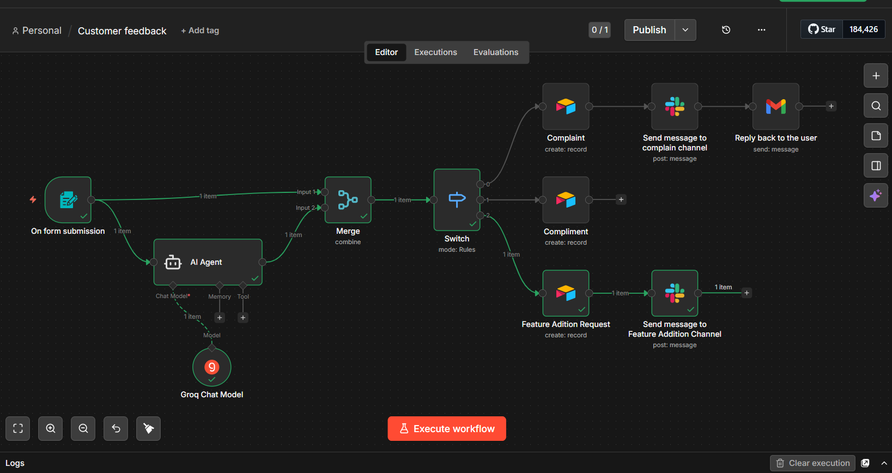

 AI-Powered Customer Feedback Automation
 
 📌 Project Overview
 This project is an intelligent, end-to-end automation workflow designed to close the feedback loop. Built using n8n, it transforms raw customer input into structured, actionable data by leveraging Large Language Models (LLMs) for real-time classification and routing.

 
 ### 📊 Database View (Airtable)

### 📧 Automated Email Response (Gmail)
.

- AI Agent (Groq): Analyzes the sentiment and intent of the text.
  
- Merge Node: Combines the original user identity with the AI's classification.
  
- Switch Node: Routes the data based on the AI category.
  
- Airtable: Creates a new record in the "Feedback" table.
  
- Slack: Pushes a formatted message to the #customer-success channel.

   
🛠 Tech Stack
- n8n- Primary orchestration and workflow engine.
  
- Groq / Llama - 3High-speed LLM for text classification.
  
- AirtableCloud-based relational database for feedback logs.
  
- Slack- Real-time communication and team alerts.

🚀 Getting Started

Prerequisites

- A self-hosted or Cloud instance of n8n.
  
- An Airtable account and Base ID.
  
- A Slack Workspace and App Token.
  
- A Groq API Key (or OpenAI/Anthropic)

Installation

1. Clone the Repo:
Bashgit clone https://github.com/your-username/customer-feedback-automation.git

2. Import Workflow:
- Open n8n.
- Click on Workflows > Import from File.
- Select workflow.json.

3. Configure Credentials:
- Update the Airtable node with your Personal Access Token.
- Update the Slack node with your OAuth token.
- Update the AI Model node with your API provider of choice.

4. Activate:
- Click "Execute Workflow" to test, then toggle the "Active" switch.

💡 Key Learnings

- Conditional Logic: Mastered the use of Switch nodes to handle multi-path data routing.
  
- Prompt Engineering: Refined AI prompts to ensure consistent classification outputs (JSON-friendly strings).
  
- API Integration: Managed OAuth and API-key authentication across multiple third-party services.
